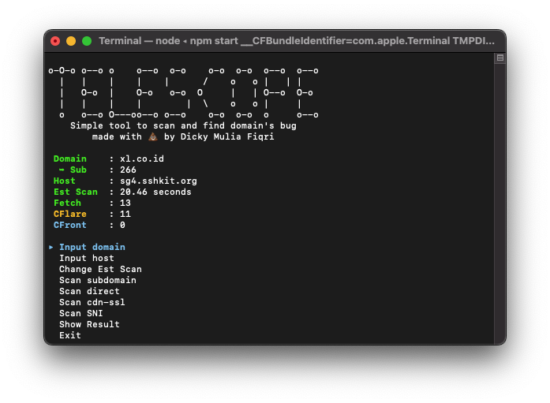

<div align="center">
    <h1>Telescope</h1>
    <i>Simple tool to scan and find domain's bug</i>
</div>

<div align="center" >
    
</div>

## Info

```
Work Is Still In Progress

- Expect some breaking changes in the future commit
- Contributors are highly welcome to make this project out of alpha build
```

## How To Use

1. Make sure node and npm are properly installed on your device
2. Clone this repo
3. Run `npm install`
4. Run `npm run build`
5. Run `npm start`
6. You're good to go

## Credit

- [bugscanner-go](https://github.com/aztecrabbit/bugscanner-go) Telescope is highly inspired from this project
- Online services that used to enum subdomains
